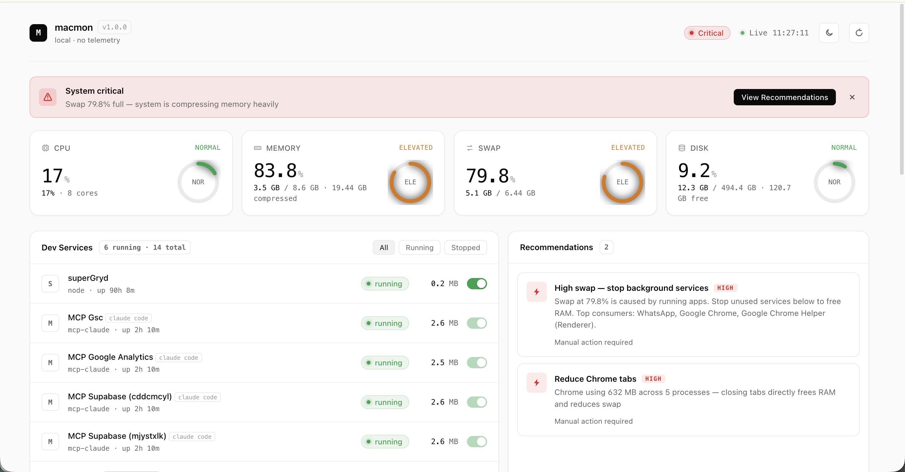

# macmon — Mac System Monitor

A dashboard that lives in your browser and tells you exactly what your Mac is doing — and what to do when it slows down. Runs locally. No account. No internet. Nothing leaves your machine.



---

## Quick install

```bash
pip install macmon
macmon start
```

Browser opens automatically. Done.

> **New to this?** Skip to the [step-by-step install guide](#step-by-step-install-for-everyone) below.

**Want to run from source?**
```bash
git clone https://github.com/jagangirisaballa/macmon.git
cd macmon
pip install -e .
```

---

## Why use this instead of Activity Monitor?

Activity Monitor shows you what's happening. macmon tells you **what to do about it**.

| | Activity Monitor | macmon |
|--|--|--|
| CPU / RAM / Disk at a glance | Scattered across 5 tabs | One screen |
| Stop a background service cleanly | No — force-kill only | Yes, one click |
| Start a stopped service | No | Yes |
| "What should I do right now?" | Nothing | Ranked recommendations with fix buttons |
| Free up inactive memory | No | Yes (with one click) |
| Lives in a browser tab while you code | No | Yes |

---

## What's on the dashboard

**Four metric cards** (CPU, Memory, Swap, Disk) — colour-coded green/yellow/red, updated every 2 seconds.

**Alert banner** — appears when macmon detects a problem, with a plain-English explanation. Example: *"Swap at 45% — memory pressure building"*.

**Dev Services panel** — lists every Homebrew service, Node server, Python server, and MCP server running on your Mac, with a toggle to stop or start each one. Background services quietly consume RAM even when you're not using them — this panel makes it trivial to free that memory.

**Recommendations panel** — macmon reads your current state and tells you exactly what to do. Examples:
- *"Redis using 48 MB — stop if not actively developing"* → Execute button stops it
- *"Chrome using 1.2 GB across 14 processes — close tabs to free RAM"* → manual action

**Top Processes** — the 10 heaviest processes on your Mac right now, sortable by CPU or Memory, with a kill button (asks for confirmation first).

---

## Step-by-step install (for everyone)

### What you need first

- A Mac running **macOS 12 (Monterey) or newer**
- **Python 3.9 or newer** — this is the only thing you need to install yourself. Everything else is automatic.

---

### Step 1 — Open Terminal

Terminal is a built-in Mac app. You type commands into it, press Enter, and things happen.

- Press **Cmd + Space**
- Type `Terminal`
- Press **Enter**

A window opens with a blinking cursor. Leave it open — you'll type everything here.

---

### Step 2 — Check if Python is installed

Type this and press **Enter**:

```
python3 --version
```

**What you'll see:**

- `Python 3.9.x` or higher → you're good, skip to Step 3
- `command not found` or `Python 2.x` → you need to install Python (see below)

**Installing Python (only if needed):**

1. Go to **https://www.python.org/downloads/** in your browser
2. Click the big yellow **"Download Python 3.x.x"** button
3. A `.pkg` file downloads — open it from your Downloads folder
4. Click **Continue → Continue → Agree → Install** — enter your Mac password if asked
5. When it says "Installation was successful", click **Close**
6. Press **Cmd + Q** to fully quit Terminal, then reopen it (Cmd + Space → Terminal)
7. Run `python3 --version` again — it should now show `Python 3.x.x`

---

### Step 3 — Download macmon

In Terminal, run:

```
git clone https://github.com/jagangirisaballa/macmon.git
```

This downloads the macmon files onto your Mac into a folder called `macmon`.

> **If a popup appears saying "Install Command Line Tools"** — click Install and wait for it to finish (a few minutes). Then run the command above again.

Now move into that folder:

```
cd macmon
```

The text at the start of your Terminal line will now include `macmon`. That means you're in the right place.

---

### Step 4 — Install macmon

```
pip3 install macmon
```

This downloads macmon and the four small libraries it needs. Lots of text will scroll by — that's normal. It takes about 30 seconds. When your cursor comes back with no red error text, it worked.

---

### Step 5 — Start the dashboard

```
macmon start
```

Your browser opens automatically and shows the macmon dashboard. You're done.

The address is **http://localhost:9999** — this is like a website, but it only exists on your own Mac. Nothing outside your computer can see it.

---

## Daily use — cheat sheet

| What you want to do | Command |
|--|--|
| Start the dashboard | `macmon start` |
| Open the dashboard (already running) | Go to `http://localhost:9999` in your browser |
| Stop macmon completely | `macmon stop` |
| Check if macmon is running | `macmon status` |
| View logs (for troubleshooting) | `macmon logs` |
| Start on a different port | `macmon start --port 8080` |

**Tip:** Bookmark `http://localhost:9999`. As long as macmon is running you can open the dashboard any time without touching Terminal.

**macmon runs in the background** — you can close Terminal after `macmon start` and the dashboard keeps working. Use `macmon stop` when you want to shut it down completely.

---

## Troubleshooting

**`macmon: command not found`**
Close Terminal fully (Cmd + Q), reopen it, and try again. If that doesn't fix it, run `pip3 install macmon` again.

**Browser doesn't open automatically**
Open your browser manually and go to `http://localhost:9999`. If that shows nothing, run `macmon stop` then `macmon start`.

**Dashboard stuck on "Connecting…"**
The server stopped unexpectedly. Run `macmon stop` then `macmon start`.

**Port 9999 is already in use**
Something else is using that port. Run `macmon start --port 8080` and open `http://localhost:8080` instead.

**Something else went wrong**
Run `macmon logs` and look at the last few lines. If you're filing a bug report, paste that output into the issue.

---

## Optional: macOS notifications

macmon can send you a native Mac notification (like the ones from Messages or Mail) when your system is under memory pressure.

Requires Homebrew. If you have it:

```bash
brew install terminal-notifier
```

If you don't have Homebrew, skip this — macmon works fine without it.

---

## Requirements

- macOS 12 (Monterey) or newer — Apple Silicon or Intel
- Python 3.9+ (free at python.org)
- Homebrew (optional — enables service stop/start and notifications)

---

## Contributing

PRs welcome. Open an issue first for anything major.

## License

MIT © Jagan Girisaballa
